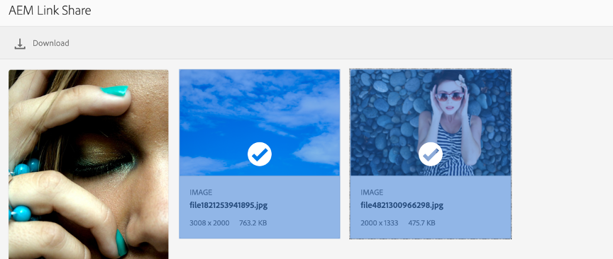

# L737 - Accelerate Brand Asset Sourcing, Distribution, and Experiences with DAM

## Table of Contents

* [Lab Overview](#lab-overview)
* [Lesson 1 - Asset Sourcing in Brand Portal](#lesson-1---asset-sourcing-in-brand-portal)
* [Lesson 2 - Publish & Share Approved Assets](#lesson-2---publish-&-share-approved-assets)
* [Lesson 3 - Search & Download Assets](#lesson-3---search-&-download-assets)
* [Lesson 4 - Asset Share Commons](#lesson-4---asset-share-commons)
* [Lesson 5 - Connected Assets](#lesson-5---connected-assets)
* [Additional Resources](#additional-resources)

## Lab Overview

TBD

### Key Takeaways

* TBD
* TBD
* TBD

### Prerequisites

* TBD
* TBD
* TBD

# Lesson 1 - Asset Sourcing in Brand Portal

## Objective

1.	Learn how internal AEM Assets users can request and source new assets from external agency/partners through Brand Portal
2.	Learn how to provide the base line assets required for creating the requested assets
3.	How the partners/agencies can upload the new assets into Brand Portal
4.	How the new assets are sent back to AEM author from Brand Portal

## Lesson Context

The Asset Sourcing workflow is a multi-step process involving the marketer who requests for sourcing of the new assets and the external agency or partner who uploads the new assets into Brand Portal. 
This lesson will outlines the various steps required to setup this collaboration between the internal marketing users and the external agency/partner users of Brand Portal.
 

### Exercise 1.1 Configuring Contribution folders in AEM Author

The users in AEM Author can setup new contribution folders and also include a short brief of the assets they want to source and also specify the list of Brand Portal users who can submit assets into this contribution folder. Following are the steps to create a new contribution folder: 

* Login to the AEM Assets Author instance 
    * Go to http://localhost:4502 and enter the following credentials
    * Username: admin
    * Password: admin 

* Navigate to **Assets > Files** which lists all the existing folders in the AEM Assets repository.
* Create a new folder by clicking on **Create** button on the top right corner
* Enter the name of the new folder as **WKND Banners**
* Mark the checkbox for **Asset Contribution**
* Finally click on **Create** button to create the new contribution folder

 

* The next step allows the marketer to provide a brief about the requested assets and specify who should have access to this contribution folder. Please click on **Skip** to proceed and create the folder
* You have successfully created a contribution folder in AEM Author
* Open the contribution folder by clicking on it to see two sub folders– **SHARED** and **NEW** that are automatically created within the contribution

 

### Exercise 1.2 Uploading baseline assets in AEM Author

The next step is to upload the baseline assets that may required for the external agency/team to create the new assets that are requested through this sourcing process. Following are the steps to upload the baseline assets: 

* Login to the AEM Assets Author instance 
   * Go to http://localhost:4502 and enter the following credentials
   * Username: admin
   * Password: admin 

* Navigate to **Assets > Files** which lists all the existing folders in the AEM Assets repository
* Navigate to **Assets > Files > WKND Banners** and in which you want to upload baseline assets
* You can see two sub folders– **SHARED** and **NEW** within the contribution folder
* Click on the **SHARED** folder 
* Click **Create > Files** to upload individual assets into the **Shared** folder 

* Select the assets from the folder **Desktop > L737-Assets > Lesson 1 > Baseline** folder
* Click **Open** and then click **Upload** on the next dialog to successfully upload the baseline assets into **Shared** folder

### Exercise 1.3 Publishing the contribution folder to Brand Portal

After setting up the contribution folder and uploading the baseline assets into the Shared sub-folder, the next step is to publish the contribution folder along with the baseline assets to Brand Portal, to make them available for the designated Brand Portal users.

* Go back to the root asset folder: http://localhost:4502/assets.html/content/dam 
* Select the **WKND Banners** folder and click on **Quick Publish**, then select **Publish to Brand Portal** link in the top menu

This will publish the Contribution folder to Brand Portal. 
* An email notification is sent to the Brand Portal users/groups who are selected at the time of creating the contribution folder. They can login to Brand Portal and contribute the requested assets

### Exercise 1.4 Uploading assets into contribution folder in Brand Portal

Once the Contribution folder is published to Brand Portal, the designated users with appropriate access can see the Contribution folder and download the baseline assets from the Shared folder. They can then upload the new assets only into the **New** folder available under the Contribution folder. The following steps will take you through the process of uploading these new assets into Brand Portal.

#### Downloading baseline assets

* Access the AEM Brand Portal instance by using the following URL:

    https://adobesummit.brand-portal-stage.adobe.com/

* Login to Brand Portal by using the following user credentials:
    * **Username**: bpuser+XX@adobetest.com
    * **Password**: “Summit-2020”
* Go into the folder **WKND Banners > Shared** folder to see the baseline assets
* Select the required assets by hovering over the assets and click on the Checkbox
* Click on the **Download** button on the top menu bar to download the baseline assets to the desktop

#### Uploading new assets

* Go back to the **WKND Banners** folder by clicking on the **Shared** dropdown menu at the top and select **WKND Banners** from the menu
* Click on the **New** folder to go into the folder
* Click **Create > Files** to upload individual assets into the **New** folder 
* Select the assets from the **Desktop > L737-Assets > Lesson 1 > Upload** folder from the local desktop

* Click on **Open** and then click on **Upload** button on the next dialog to successfully upload the new assets into the **New** folder on Brand Portal

### Exercise 1.5 Publishing new assets from Brand Portal back to AEM 

After uploading the requested assets into Brand Portal, it is now time to publish these new assets back to the AEM Author for the marketer to review and approve the assets. 

* Go to the root folder of Brand Portal using the level selector at the top

* Select the **WKND Banners** folder and click on **Publish to AEM** 

* A success message will be shown for the publish request, as seen in the screen shot below

* To check the status of the, unselect the **WKND Banners** folder and click on the AEM icon  on the top left corner
* Click on the Asset Contribution Status card
* You will see the list of all the Publish to AEM requests raise in the past and their status

* The publish back to AEM take approximately 5-6 minutes from the time of initiating the request from Brand Portal

•	To see the new assets sourced from Brand Portal, log into AEM Author instance
* Login to the AEM Assets Author instance 
   * Go to http://localhost:4502 and enter the following credentials
   * Username: admin
   * Password: admin 
* Navigate to **Assets > Files > WKND Banners > New** to see the new assets that are sourced from Brand Portal into AEM Author

# Lesson 2 - Publish & Share Approved Assets

## Objective

1. Learn about the actions marketers need to take to publish assets from AEM Assets to Brand Portal
2. Learn how to share the assets & folders from Brand Portal with internal and external users

## Lesson Context

This lesson will cover steps performed by Marketers and Content Authors to manage assets in AEM Assets and to publish assets to Brand Portal.

### Exercise 2.1 Publishing Assets

This exercise will cover steps to publish approved assets from AEM into Brand Portal for the users to be able view and download the assets

* Let us start by creating new folder in AEM Author
* Login to the AEM Assets Author instance 
   * Go to http://localhost:4502 and enter the following credentials
   * Username: admin
   * Password: admin 
* Click on the **Create** button & select **Folder** from the dropdown menu

* On the Create Folder panel, set name & title for the folder.
* Naming convention for this lab: ‘**L737-AttendeeName-AttendeeOrganization**’ (e.g. L737-Rajit- Adobe).

* Navigate to the newly created folder & upload sample assets into the folder using Touch UI upload or Drag & Drop feature in AEM

* * *

_**Note**: Sample assets for this step can be found on your system at **Desktop > L737-Assets > Lesson 2 > Upload-Private**_

* * *

* Now create another folder **inside this newly created folder** with name ‘**L737-AttendeeName- AttendeeOrganization-public**’ i.e. (L737-Rajit-Adobe-public).

* Navigate to the newly created folder & upload sample assets into the folder using Touch UI upload or Drag & Drop feature in AEM.
* * *
_**Note**: Sample assets for this step can be found on your system at **Desktop > L737-Assets > Lesson 2 > Upload-Public**_
* * *

* Go to the root folder of Brand Portal using the level selector at the top
* Select the root folder ‘**L737-AttendeeName-AttendeeOrganization**’ & publish to Brand Portal using the **Quick Publish** option in Touch UI Action bar.
* This will publish the folder, its assets, and sub-folders from AEM Assets Author to the Brand Portal which can then be shared with internal & external agencies.

### Exercise 2.2 Validate the published assets

In this exercise, we will login to Brand Portal and confirm that your assets have been successfully published and ready to share.

* Access the AEM Brand Portal instance by using the following URL:

    https://adobesummit.brand-portal-stage.adobe.com/

* Login to Brand Portal by using the following user credentials:
    * **Username**: bpuser+XX@adobetest.com
    * **Password**: “Summit-2020”

  * Navigate to the folder **L737-Rajit-Adobe** you have published in the previous step and confirm that the published assets are visible in the Brand Portal  

### Exercise 2.3 Sharing Assets from Brand Portal

Assets in BRand Portal can be shared with users who have an account within Brand Portal, as well as with external users via email. This exercises walks us through the process of sharing assets with both internal & external users.

To share assets as link, follow these steps:

* Browse the Folder you have published to Brand Portal (e.g **L737-Rajit-Adobe**).
* Select multiple assets that you want to share. Click on **Share Link** in top toolbar. This opens up the link sharing dialog

* In the email field, type email ID of the user with whom you want to share the link. This allows sharing with multiple users:
    * If the user is part of the organization, select their email ID from the suggestions that appear in the dropdown
    * For external users, enter the complete email address and hit Enter. External email ID is added to the list

* * *

_**Note**: For this lab, add your email ID that you can access from the Summit Lab computer_

* * *

* In the subject box, type subject for assets to be shared.
* Add the required message to be included in the email.
* In the Expiration field, use date picker to set the expiry date for the link (default is 7 days).
* Click on **Share**.
* For the lab, you can copy the link from the **Share Link** mentioned in above Link Sharing Dialog image and paste into private window of a new browser.
* Users will also receive email containing the link

* The link will bring them directly into Brand Portal and show them the shared assets
* They can click on the shared link and download the assets. 

### Exercise 2.4 Public Folders 

With Brand Portal, it's possible to make certain folders public so that any user can access those folders without needing to login to Brand Portal.

This exercise will show how to setup public folders. To make a folder public in Brand Portal:

* Navigate into the **L737-AttendeeName-AttendeeOrganization** folder you published to Brand Portal earlier
* Select the Sub-Folder **L737-AttendeeName-AttendeeOrganization-public** (e.g ‘L737-Rajit-Adobe-public’) & click on **Share** in top tool bar

* Folder Options would open, Check **Public Folder** option & hit **Save**.

* This will make the folder public & assets inside the folder should be visible to all Brand Portal users & guest users (covered as part of next exercise).

### Exercise 2.5 Guess User Access

* With Guest Access enabled by the administrator on the Brand Portal, guest users will have option available on the login screen

* _**Note**: At a time 10% of total user quota can be used by guest sessions. So if a tenant has been provisioned to have 100 users, at a time only 10 active guest sessions can exists. If an 11th user tries to access he will be displayed a warning. When an existing guest user ends his session, a new session will be allowed_

* To review guest user access, open a browser in private browsing window.

* Open Brand Portal Again, you should see Guest User Access option on login screen

    https://adobesummit.brand-portal-stage.adobe.com

* _**Note**: Guest User session is active for 2 hours since login (until user Ends Session)_

* All Public Folders will be available to guest users to view and download assets or any folder specifically shared with guest.
* Guest users can download the assets using download modal.

* To end session, Guest user can click on top right and ‘End Session’

These steps will allow organization to share assets with authorized users & guest users via Brand Portal.

# Lesson 3 - Search & Download Assets

## Objective

1.	Review Search capability & associated features of Brand Portal
2.	Review Asset Download options in Brand Portal 

## Lesson Context

This lesson will cover how users can search for assets in Brand Portal & download them.

### Exercise 3.1 Searching in Brand Portal

This exercise will cover search capability in Brand Portal

* To perform search in Brand Portal, click on the Search icon on the top toolbar.
* In the search box, type a keyword for asset you want to search. For example, try the word '**sky**'

You will see results pertaining to the text with which you performed the search, for example in this case you will see pictures that include sky. 

* With Smart Tags configured in your AEM Assets, Brand Portal supports smart tag based searches. (AEM publishes the smart tags for each asset while publishing them to Brand Portal).

* * *
_**Note**: The **Assets Smart Tags** feature increases the accuracy and efficiency of search in AEM & Brand Portal by automatically adding metadata tags to image assets that you upload into AEM. You can also configure AEM to automatically apply tags in bulk to all assets within a folder_

* * *

* To filter/narrow down the search results, use faceted search using Search Filters on the left

* Users can save common/recent search using ‘Save Smart Collections’. Enter the collection name and click Save
* Saved Searches can be accessed by using the Saved Searches dropbox in Filter
2.5-saved-search

### Exercise 3.2 Downloading from Brand Portal 

This exercise will cover the process and options to download assets from Brand Portal.

* Users can download a single asset or multiple asset using download icon on the asset card view or click **Download** in top toolbar

* Download modal will show up, which allow users to download the asset including renditions. If asset has pTiff rendition existing, then dynamic rendition download option is enabled

* Brand Portal allows user to send email notification to authorized user (including partners & vendors) about the download, user will get email notification when assets (in ZIP format) are ready to download - Optional for this lab exercise.

* Users can include static renditions if required or just download the original asset.

* * *

_**Note**: Users with roles as **Editor** or **Viewer** cannot download **Expired Assets** from Brand Portal. Only **Administrator** can download Expired asset. You can use Asset Expiration Report to get a list of all the expiring assets in Brand Portal_

* * *

# Lesson 4 - Asset Share Commons

Asset Share Commons is a modern, open-source reference implementation of Asset Share Portal, built using the latest AEM standards & features. Customers can extend this reference implementation to build a custom UI with the desired look-and-feel as well as augment the features with any custom business functionalities that may be required for the business. This Lesson will introduce you to the default implementation of Asset Share Commons and help you understand and explore the possibilities of using this further.

## Objective

1.	Explore and understand what Asset Share Commons is
2.	Try out the various page, functionalities & options available in Asset Share Commons

## Lesson Context

For this lesson, we will be using the default implementation that is available with the Asset Share Commons library.

### Exercise 4.1 Homepage & Search

In this exercise, you will explore the key pages that are available as part of the Asset Share Commons reference implementation

* Open the Asset Share Commons homepage at 

    https://aem.enablementadobe.com/content/asset-share-commons/en/light.html

* Switch between the Grid & Listing views to see how the display of the asset list changes

* Explore the facets & filters available for narrowing down the listing of images further . For example, choose the asset type to be Video and the left pane will show videos available in the repository

* Use the Search bar at the top to initiate a search. For example search for “Mountains” and you will see related images accordingly

* Finally click on the Asset Share Commons logo  at the top left corner to navigate back to the homepage

### Exercise 4.2 Homepage & Search

* Click on any of the assets to go to the asset details page
* Notice the various tags and metadata of the asset displayed on the right pane of the screen
* Click on any of the **Renditions** below the image to download the corresponding rendition
* You have additional options to **Share** and **Add To Cart** actions

* **Share** option allows you to share the asset with anybody through email, similar to Brand Portal
* With the **Cart** functionality, it is possible to add multiple assets to cart and then either share or download the entire cart in one go

### Exercise 4.2 UI Themes

The Asset Share Commons reference implementation follows a clean separation between the backedn and front-end implementations. This allows you to control the styling and look and feel for the site with minimal effort. In this exercise ,you can experience the same site as above but using a different UI theme.

* Open the URL https://aem.enablementadobe.com/content/asset-share-commons/en/dark.html 

* Notice that all the same functionalities are available here, but each visual element follows a different style and theming

These exercises give a sneak peak into the Asset Share Commons implementation. You can find more details about this library in its Github repository here: https://adobe-marketing-cloud.github.io/asset-share-commons/ 

# Lesson 5 - Connected Assets

## Objective

1.	Learn how to connect from AEM Sites into AEM Assets while authoring the site content
2.	Learn how to search and use the assets residing in AEM assets on the site pages being authored in AEM Sites

## Lesson Context

For enterprises that have separate AEM instances for their site management (AEM Sites) as well as the central DAM repository (AEM Assets), it is possible to connect the 2 instances such that the website authors on AEM Sites can fetch the required assets from the central AEM Assets repository. This lesson explains how the process works and allows site authors to connect to AEM Assets repository to get the required assets for use on the website.

### Exercise 4.1 Sites Authoring with Connected Assets

* Login to the AEM Assets Author instance 
   * Go to http://localhost:4502 and enter the following credentials
   * Username: admin
   * Password: admin 
* Navigate to **Sites > WKND Site > United States > English > Magazine** under the site hierarchy
* Select the **Western Australia** page by checking the box next to it
* Click on **Edit** in the menu at the top left part of the page

* Make sure that the page is in **Edit** mode by ensuring that the **Edit** link at the top right section of the page is highlighted
* Expand the side panel by click on the icon at the top left corner of the page, to open the content finder

* Click on the Cloud icon on the left strip of the content finder and then click on **Log in to Connected Assets** button in the next panel

* A window pops-up requesting for credentials for connecting to the AEM Assets instance
* Enter the username & password as follows: 
    * **Username**: admin
    * **Password**: admin

* The Connected Assets pane on the left side will start showing a listing of the various assets present in the remote AEM Assets repository

* You can further search and filter the listing to suit the need
* Scroll down to the bottom of the page in the right pane
* Drag and drop one of the images from the **Connected Assets** panel onto the page

* You have successfully browsed the central DAM repository and pulled an asset and used it on the page in Sites

# Additional Resources

* AEM Assets Brand Portal User Guide

    https://helpx.adobe.com/experience-manager/brand-portal/user-guide.html

* Documentation and Tutorials for Setting up and using Asset Sourcing

    https://docs.adobe.com/content/help/en/experience-manager-brand-portal/using/asset-sourcing-in-brand-portal/brand-portal-asset-sourcing.html

* Code & Documentation for Asset Share Commons

    https://adobe-marketing-cloud.github.io/asset-share-commons/

