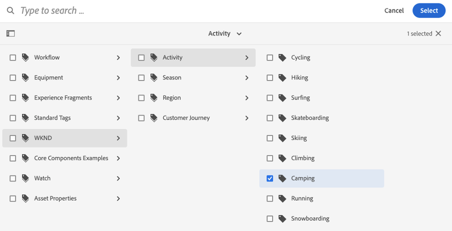
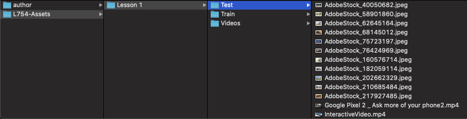
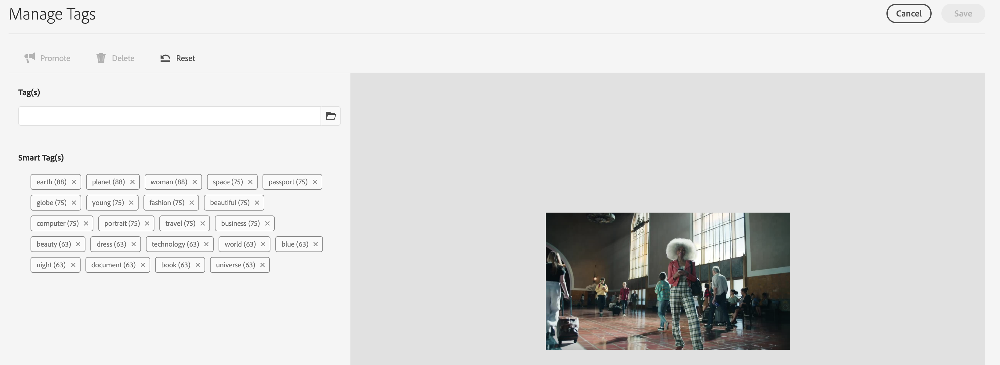
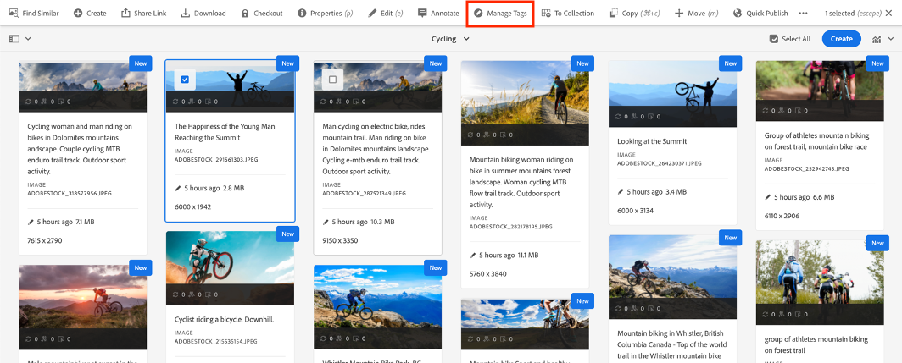

# L754 - Digital Asset Management in an AI-First World

## Table of Contents

* [Lab Overview](#lab-overview)
* [Lesson 1 - Improve discoverability through contextual Smart Tags](#lesson-1---improve-discoverability-through-contextual-Smart-Tags) 
* [Lesson 2 - Enhanced search powered by AI](#lesson-2---enhanced-search-powered-by-ai)
* [Lesson 3 - Smart cropping of images & videos](#lesson-3---smart-cropping-of-images-&-videos)
* [Lesson 4 - Use business context to improve insights & search for assets](#lesson-4---use-business-context-to-improve-insights-&-search-for-assets)
* [Additional Resources](#additional-resources)

## Lab Overview

TBD

### Key Takeaways

* TBD
* TBD
* TBD

### Prerequisites

* TBD
* TBD
* TBD

# Lesson 1 - Improve discoverability through contextual Smart Tags

## Objective

1.TBD
2.TBD

## Lesson Context

TBD
 

### Exercise 1.1: Training for Custom Smart Tags 

To demonstrate the Enhanced Smart Tag capabilities, the following exercises assume that we are dealing with assets related to different types of adventure travel campaign and related banners. The exercise will show you how we can train the Smart Tagging service on the different types of assets with specific pre-defined tags using a set of training assets. Towards the end of the exercise, we will upload a mix of both types of images and check how the tagging service automatically applies appropriate tags to the assets.

#### 1.1.1 Review the taxonomy

In order to train the Smart Tagging service with your custom tags, you have to have a well-structured taxonomy of tags that effectively represents the concepts applicable to your business or domain. For this lab, a sample taxonomy has already been setup, that you can use for training the Smart Tagging service. This exercise walks you through the sample taxonomy structure, in preparation for the next exercises.

* Login to the AEM Assets Author instance 
    * Go to http://localhost:4502 and enter the following credentials
    * **Username**: admin
    * **Password**: admin 

* Open **Global Navigation** by clicking on the AEM Logo ()the upper left corner of the screen.
* Select the **Tools** (_hammer_) icon from the left railing. The right panel will default to **General**.

* Navigate to the **Tagging** card on the right to open your **Tag Manager** console

* Click on the **WKND** namespace in the left column to open the next level tags
* You will notice that the taxonomy contains several tags. We will be using the following tags:
    * **WKND > Activity > Cycling**
    * **WKND > Activity > Camping**
    * **WKND > Season > Summer**
    * **WKND > Season > Spring**

In the next exercises, you will be using these tags to train the Smart Tagging service

#### 1.1.2. Setup the sample assets required for training

With the custom taxonomy in place, it is time to setup sample assets that are required for training the Smart Tagging service with the custom tags. This is done by uploading a sample set of assets that are representative of the concepts or tags that you want the smart tagging service to learn.

This exercise demonstrates the process to carry out such a training.

##### Create the folder structure in AEM for training

* Login to the AEM Assets Author instance 
    * Go to http://localhost:4502 and enter the following credentials
    * **Username**: admin
    * **Password**: admin 
* Go to the following location in your local AEM instance: http://localhost:4502/assets.html/content/dam/wknd 
* Click on **Create** button on the top right corner
* Select **Folder** in the fly-out menu

* Provide the Title for the new folder as **Banners**
* Click on the **Create** button to create the new folder

##### Enable Smart Tagging on the new folder

* Select the **Banners** folder by hovering over the folder name and selecting the check mark icon
* Click on the **Properties** link in the top menu bar to open the folder properties
* Check the **Enable Smart Tags** option and then click on **Save & Close**

##### Create the Sub-folders 

* Go into the **Banners** folder by clicking on the folder name
* Follow the Steps 1 & 2 above to create two sub-folders within **Banners** folder, as per below structure: 
    * **Banners > Camping**
    * **Banners > Cycling**

* Enable Smart Tags on both the folders, as done earlier with the parent folder

##### Upload the first set of sample assets for Camping

* Go into the **Banners > Camping** folder in AEM by clicking on the folder name
* Open Finder on the desktop
* Navigate to **Desktop > Assets > Lesson 1 > Train > Camping** folder 

* Select all the files in that folder 
* Drag-&-drop them onto the AEM window in the browser
* Wait for the processing of the assets to be completed which may take 1-2 minutes, then refresh the page
* Once the processing is done, all the assets are shown with a **New** label on the right corner

##### Tag the assets with the custom tag for Camping

* Go into the **WKND Site > Banners > Camping**  folder in AEM Assets
* Click on **Select All** button on the top menu bar next to the Create button

* In the properties screen, open the Tag browser by clicking on the check mark under **Tags** section
* Navigate to **WKND > Activity > Camping** in the tag hierarchy and select the tag, then click on **Select** button to apply the tag

* Similarly add another tag by navigating  to **WKND > Season > Summer** in the tag hierarchy and select the tag, then click on **Select** button to apply the tag

* Finally click on the **Save & Close** button on the properties screen, then check the **Append** option and finally click **Submit** to save the tag successfully

##### Upload a second set of sample assets for Cycling

* Go into the **WKND Site > Banners > Cycling**  folder in AEM Assets by clicking on the folder names
* Open Finder on the desktop
* Navigate to **Desktop > Assets > Lesson 1 > Train > Cycling** folder
* Select all the files in that folder 
* Drag-&-drop them onto the AEM window in the browser
* Wait for the processing of the assets to be done which may take 1-2 minutes, then refresh the page
* Once the processing is done, all the assets are shown with a **New** label on the right corner

##### Tag the assets with the custom tag for Cycling

* Go into the **WKND Site > Banners > Cycling** folder in AEM
* Click on **Select All** button on the top menu bar next to the Create button
* In the properties screen, open the Tag browser by clicking on the check mark under **Tags** section
* Navigate to **WKND > Activity > Cycling**  in the tag hierarchy and select the tag, then click on Select button to apply the tag

* Similarly select the **WKND > Season > Spring** tag from the hierarchy

* Finally click on the **Save & Close** button on the properties screen, then check the **Append** option and click on **Submit** button to save the tag successfully

* * * 
**Note**:

##### Choosing the Training Assets

Training the Smart Tag service to tag images automatically with custom tags requires certain qualities in the training images
* **Quantity and Size**: Use about 25-30 images per tag with a minimum of 500 pixels on the longer side
* **Coherence**: Images tagged with the same tag should be visually similar
* **Coverage**: Have sufficient variety in the training images in terms of color, orientation and sizes of the same subject
* **Distraction/Obstruction**: Lesser the distractions in the image and better focus on the primary subject, better will be the training accuracy
* **Distinction**: Images representing each tag should be easily distinguishable from those representing other tags
* **Union**: For those images that qualify for multiple tags, all applicable tags should be applied during training

* * * 

#### 1.1.3.	Run the Smart Tag Training workflow

Having setup sample assets with the necessary tags for training, the final step for successfully completing the training process is to run those sample assets through the training workflow so that the Smart Tagging service can process and learn the custom tags.

##### Locate the workflow model for Smart Tags Training

* Login to the AEM Assets Author instance 
    * Go to http://localhost:4502 and enter the following credentials
    * **Username**: admin
    * **Password**: admin 
* Open **Global Navigation** by clicking on the AEM Logo ()the upper left corner of the screen.
* Select the **Tools** (_hammer_) icon from the left railing. . Then select the **Workflow** item in the middle pane that opens up the workflow related cards on the right pane

* Navigate to the **Models** card on the right to open your **Workflow Models** listing 

##### Start the Smart Tags Training workflow

* Look for the workflow model **Smart Tags Training** in the workflow model listing page
* Select the workflow model by hovering over the card and click on the check mark icon
* Click on **Start Workflow** item on the top menu bar

* In the popup dialog of the workflow, click on the browse icon under **Payload** field to select the right payload folder
* Choose the parent folder **Banners** as the payload for the workflow by navigating to the path **content > Assets > WKND Site > Banners** and then clicking on the check box

* Give a Title and Description of your choice in the workflow dialog and then click on **Run** button
* This step triggers the Smart Tags Training workflow and lets it run in the background
* Once this workflow is completed, the Smart Tagging service would have been trained with the custom tags that you had setup for the sample assets

* * * 
**Note**:
##### Verifying status of the training

* Click on the AEM logo, and go to **Tools > Assets > Reports**
* In the Asset Reports page, click **Create**
* Select the **Smart Tags Training** report, and then click **Next** from the toolbar.
* Specify a title and description for the report. Under **Schedule Report**, leave the **Now** option selected. Then, click **Create** from the toolbar
* In the **Asset Reports** page, select the report you generated. To view the report, click the **View** icon from the toolbar
* The report displays the training status for the tags you trained. 
* **Green color** in the **Training Status** column indicates that the Enhanced Smart tags service is trained for the tag. 
* **Yellow color** indicates that the service is not completely trained for a particular tag. In this case, add more images with the particular tag and run the training workflow to train the service completely on the tag.
* If you do not see your tags in this report, run the training workflow again for these tags

* * *

### Exercise 1.2: Uploading and auto-tagging assets

#### 1.2.1 Apply Custom Tags to new Assets based on the training

Once the training is done, the tagging service is equipped to identify relevant assets that get uploaded and then automatically tag with appropriate tags. 

This exercise demonstrates how the application of the previously trained custom tags works. In this exercise, we will upload some new assets into a designated folder and then validate that the trained custom tags are applied on them

##### Create a new folder for uploading test assets

* Login to the AEM Assets Author instance 
    * Go to http://localhost:4502 and enter the following credentials
    * **Username**: admin
    * **Password**: admin 
* Go to the following location in your local AEM instance: http://localhost:4502/assets.html/content/dam/wknd 
* Click on **Create** button on the top right corner
* Select **Folder** in the fly-out menu
* Provide the Title for the new folder as **Banners-New**
* Click on the **Create** button to create the new folder

##### Create a new folder for uploading test assets

* Select the **Banners-New** folder by hovering over the folder name and selecting the check mark icon
* Click on the **Properties** link in the top menu bar to open the folder properties
* Check the **Enable Smart Tags** option and then click on **Save & Close**

##### Upload test assets for auto-tagging

* Go into the **Banners-New** folder in AEM by clicking on the folder name
* Open Finder on the desktop
* Navigate to **Desktop > Assets > Lesson 1 > Test** folder

* Select all the files in that folder 
* Drag-&-drop them onto the AEM window in the browser
* Wait for the processing of the assets to be done which may take 1-2 minutes, then refresh the page
* Once the processing is done, all the assets are shown with a New label on the right corner

##### Check properties of the assets for validating application of custom tags

* Go into the **Banners-Ne**w folder in AEM by clicking on the folder name
* Select any asset by hovering over the asset and selecting the check mark icon
* Click **Manage Tags** option from the menu bar at the top

* You will notice that the asset would have the custom tags (that were part of the training) depending on which asset you are looking at.

* Use asset switcher arrows below the asset preview to switch between the assets and observe the application of the custom tags
* You may also notice that some of the assets may not get any of the custom tags. This happens with the tagging service does not identify the subjects in the image correctly.  

Any new assets ingested after the training can potentially be tagged with the custom tags based on the subject of the images being ingested.

### Exercise 1.3: Enrich video assets with Smart Tags

AEM not only supports automatic tagging of images, but also automatically suggests tags for video assets as well.  In this exercise, you will see the tagging of video assets in action.

#### 1.3.1 Create a new folder for uploading video assets

* Login to the AEM Assets Author instance 
    * Go to http://localhost:4502 and enter the following credentials
    * **Username**: admin
    * **Password**: admin 
* Go to the following location in your local AEM instance: http://localhost:4502/assets.html/content/dam 
* Click on **Create** button on the top right corner
* Select **Folder** in the fly-out menu
* Provide the Title for the new folder as **Videos**
* Click on the **Create** button to create the new folder

#### 1.3.2 Enable Smart Tagging on the new folder

* Select the **Videos** folder by hovering over the folder name and selecting the check mark icon
* Click on the **Properties** link in the top menu bar to open the folder properties
* Check the **Enable Smart Tags** option and then click on **Save & Close**

#### 1.3.3 Upload test assets for auto-tagging

* Go into the **Videos** folder in AEM by clicking on the folder name
* Open Finder on the desktop
* Navigate to **Desktop > Assets > Lesson 1 > Videos** folder
1.3-videos

* Select all the files in that folder 
* Drag-&-drop them onto the AEM window in the browser
* Wait for the processing of the assets to be done which may take 1-2 minutes, then refresh the page
* Once the processing is done, all the assets are shown with a New label on the right corner

#### 1.3.4 Check properties of the assets for validating application of custom tags

* Go into the **Videos** folder in AEM by clicking on the folder name
* Select any asset by hovering over the asset and selecting the check mark icon
* Click **Manage Tags** option from the menu bar at the top

### Exercise 1.4: Moderation of suggested tags

While the AI algorithm does a great job of suggesting many relevant tags, the control is finally in the hands of the user to curate and refine the suggested tags further to boost the search-ability of these images that are auto-tagged by the algorithm.

In this exercise, we will look at how to moderate the tags on the assets in AEM

#### 1.4.1 Select folder or image for which tags need to be moderated

* Login to the AEM Assets Author instance 
    * Go to http://localhost:4502 and enter the following credentials
    * **Username**: admin
    * **Password**: admin 
* Go to the following location in your local AEM instance: http://localhost:4502/assets.html/content/dam/wknd/banners/cycling 
* Select any asset by hovering over and clicking on the check mark
* Click on **Manage Tags** from the menu bar at the top of the screen

#### 1.4.2 Purge the unwanted tags that are not relevant to the asset

* In the tag moderation screen, select the tags that are not relevant to the image, by clicking on them. For example, in the image below, consider the following tags are not relevant and select them by clicking on them
    * **sunrise,sunset**
* Once selected, click on **Delete** button on the top left part of the screen to remove these tags from the image

#### 1.4.3 Promote relevant tags 

* We also want to indicate a higher priority to some of the more relevant tags by promoting them. We do this by selecting the relevant tags and clicking on the **Promote** button on the top menu bar. In this example asset, let us promote the following tags: 
    * **silhouette, success, achievement**

* Finally click on **Save** button to save the changes done to the tags for the image
* The Tag moderation screen allows you to switch between multiple assets of that folder and perform similar moderation on all the assets

With these steps, you have curated the auto-suggested tags to suit your assets while promoting the more relevant tags to boost the search-ability of these images greatly.

# Lesson 2 - Enhanced search powered by AI

## Objective

1.TBD
2.TBD

## Lesson Context

TBD
 

### Exercise 2.1: Text Search

#### 2.1.1 Experience the improved search efficacy with auto-tagged assets

By running the assets through the auto-tagging process, we have brought out the ‘dark assets’ to the surface with appropriate metadata applied on them. In this exercise, let us see the effects that auto-tagging and tag moderation processes have on the search experience for the users.

##### Navigate to the Assets folder in AEM

* Login to the AEM Assets Author instance 
    * Go to http://localhost:4502 and enter the following credentials
    * **Username**: admin
    * **Password**: admin 
* Go to the following location in your local AEM instance: http://localhost:4502/assets.html/content/dam

##### Initiate a new search using one of the promoted tags

* Click on the lens icon at the top right corner of the screen to open the Omnisearch
* Enter the term **earth** in the Omnisearch and hit enter
* The search results page will bring up the video that contains content related to earth. This asset would not have been discoverable without the automated tagging of the video

* Next, try entering the term **achievement** in the Omnisearch and hit enter
* The search results page will bring up the images that have a subject related to the concept of achievement, such as the image below with a person celebrating 
2.1-achievement

* Notice that we had promoted the tag **achievement** earlier for this image which prompted the search engine to bring up this image in the results, despite the asset not having anything related in the name or description 

##### Initiate a new search using one of the deleted tags

* Click on the lens icon again to open the Omnisearch
* Enter the term **sunrise** in the Omnisearch and hit enter
* This time the search results page comes back images related to sunrise, but it excludes the image for which we had moderated the tags and had removed **sunrise** from its tag set

This exercise clearly demonstrates how the Tag management capabilities in AEM add value by making the assets more discoverable through the tags and also help in increasing the efficacy of the search through tag moderation.

### Exercise 2.2: Visual Search

#### 2.2.1 Using visual search

##### Navigate to the assets root folder and search for sunrise again

* Login to the AEM Assets Author instance 
    * Go to http://localhost:4502 and enter the following credentials
    * **Username**: admin
    * **Password**: admin 
* Go to the following location in your local AEM instance: http://localhost:4502/assets.html/content/dam
* Click on the lens icon again to open the Omnisearch
* Enter the term **sunrise** in the Omnisearch, as done earlier, and hit enter
* You will the results with images related to sunrise

##### Choose the ‘Find Similar’ action for any of the asset

* Hover on the image that you are interested in, then click on the ellipsis (…) icon to open **More actions** menu
* For this example, we are using the image with sunrise & mountains together, hover on the image and click on the ellipsis (…)
* Then click on the **Find similar** item from the drop-down list

* The search results page loads up with assets that are similar to the one that we initiated the search with (containing subjects like sunrise, mountains among other subjects)

 

* Also notice on the search form at the top of the results page, it now has a small thumbnail of the image against the search was triggered, to indicate what results are being shown currently

# Lesson 3 - Smart cropping of images & videos

## Objective

1.	Explore how AEM uses AI powered Smart Crop algorithms to automatically crop images & videos based on the subject of the assets
2.	Understand how the Smart Crop capabilities can be used while authoring a page in AEM

## Lesson Context

Cropping images and video can be a time-consuming and labor-intensive endeavor that requires drawing, measuring, and cutting. With smart crop, you can compress workflows and eliminate hours of tedious work. Powered by Adobe Sensei, Adobe’s AI and machine learning framework, it automatically detects and crops the focal point in any image or video and captures the intended point-of-interest, regardless of screen size. This lesson will walk you through the process for using smart cropping your images & videos and use them in your sites & other digital channels.
 

### Exercise 3.1: Smart Crop for Images

#### 3.1.1 Review & update the smart crop definitions

* Login to the AEM Assets Author instance 
    * Go to http://localhost:4502 and enter the following credentials
    * **Username**: admin
    * **Password**: admin 
* Go to the following location in your local AEM instance: http://localhost:4502/assets.html/content/dam
* Notice the folder **Smart Assets** has 2 icons shown, apart from the folder name. These indicate that it has been setup with some image and / or video processing profiles
* Select the **Smart Assets** folder by hovering over the folder and checking the box, then click on **Properties** in the top menu bar

 

* Click on the **Image Profiles**  tab in the next screen. Then see the **Profile Name** dropdown and notice that the **Smart Crop** profile has been set on this profile. 
3.1-image-profile
 
* Also check the **Video Profiles** tab to see the **Smart Crop Video** profile is applied on this folder
 
* Click on **Cancel** to go back to the assets root folder
* Now go into the **Smart Assets** folder by clicking on the folder 
* For this lab, we have placed some sample assets that have already been processed by Dynamic Media server and have identified the smart crop definitions for them
3.1-smart-assets
 
* Open the image **20588.jpg** (cyclists) by clicking on the image card
* Open the **Renditions** pane by selecting it from the dropdown menu on the left top corner. Or simply hit **alt+3** to open the Renditions pane

* Notice the **Smart Crop** definitions listed at the bottom of the left pane
* Click on any of the definitions and the image preview indicates the size of the crop window corresponding to that definition

* You can override these crop definitions manually by click on the **Smart Crop** option in the top menu

* Move or resize the blue borders for each of the smart crop definitions to suit the subject of the image. Then click on **Save** to save the changes to the crop definitions

#### 3.1.2 Use the Smart Crop images in the site pages

* Login to the AEM Assets Author instance 
    * Go to http://localhost:4502 and enter the following credentials
    * **Username**: admin
    * **Password**: admin 
* Go to the Sites section in your local AEM instance and navigate to the following location: http://localhost:4502/sites.html/content/wknd/us/en/magazine 

* Choose the **Ski Touring** page and then click on **Edit**  button in the top menu to open the page in Authoring mode
* Make sure that you are in **Edit** mode by clicking on the **Edit** button again on the top right corner of the page
* Expand the side panel on the left, click on the **Components (+)** icon on the left strip to open the component browser. Search for **dynamic** in the search box that should bring up the **Dynamic Media** component in the results section below
* Then drag & drop the **Dynamic Media** component to the top part of the page

* Next choose the Asset browser from the left strip. Then drag and drop the **20588.jpg** (cyclists) onto the **Dynamic Media** component that we added to the page in the previous step

* Open the configuration dialog of the Dynamic Media image component by click on the image that we placed on the page, and then clicking on the wrench icon that shows up

* In the configuration dialog, switch to Dynamic Media Settings tab and choose the Preset Type to be Smart Crop

* Then click on Done to close the dialog

#### 3.1.3 See the smart cropping in action

* Switch to **Preview** mode on the page, by click on the **Preview** on the top right corner
* Enable the **Device Emulator** mode by clicking on the mobile icon on the top left corner of the screen. It opens up the ruler & device selector strip at the top of the screen 

* Now play around the selection of different devices & the portrait/landscape mode and notice how the image of the cyclists changes based on the selection

* For example, choose **iPhone 6 Plus**, as a device and then change the orientation between portrait and landscape and see how the image responds to the changing screen size
* Finally switch back to Desktop mode by clicking on the device selection dropdown menu and choosing Desktop from the list

### Exercise 3.2: Smart Crop for Videos

#### 3.2.1 Adding the Smart Crop Video component to the page

* Login to the AEM Assets Author instance 
    * Go to http://localhost:4502 and enter the following credentials
    * **Username**: admin
    * **Password**: admin 
* Go to the Sites section in your local AEM instance and navigate to the following location: http://localhost:4502/sites.html/content/wknd/us/en/magazine 
* Choose the Arctic Surfing page, and then click on Edit  button in the top menu to open the page in Authoring mode

* Make sure that you are in **Edit** mode by clicking on the **Edit** button again on the top right corner of the page
* Expand the side panel on the left, click on the **Components (+)** icon on the left strip to open the component browser. Search for **smart** in the search box that should bring up the **Smart Crop Video** component in the results section below
* Then drag & drop the **Smart Crop Video** component to the top part of the page

* Next, switch to the Asset browser in the side panel and choose **Videos** from the dropdown in the filters
* Then drag & drop the **SampleVideo_720x480_5mb.mp4** onto the Smart Crop component that we placed on the page earlier

* Open the configuration dialog of the **Smart Crop Video** component by click on the component that we placed on the page, and then clicking on the wrench icon that shows up

* In the dialog, choose the **SmartCropVideo** viewer preset from the dropdown

* Click on Done to close the dialog

#### 3.2.2 See the smart cropping in action

* Switch to the **Preview** mode on the page by clicking on **Preview** button on the top right corner
* Next, put the video player into **Full Screen** mode by clicking on the full screen button at the bottom right corner of the video

* Once in full screen mode, open the **Developer Tools** pane of Chrome browser by choosing **View > Developer > DeveloperTools** option from the top menu. Or alternatively just hit **Option+Command+I** on the mac keyboard

* The Developer tools provide an option to simulate the behaviour of various devices for viewing the content, along with the portrait and landscape modes

* While being in the developer tools mode, play the video and switch between different phone & tablet devices along with the portrait and landscape modes to see how the video adapts to the changing screen dimensions
